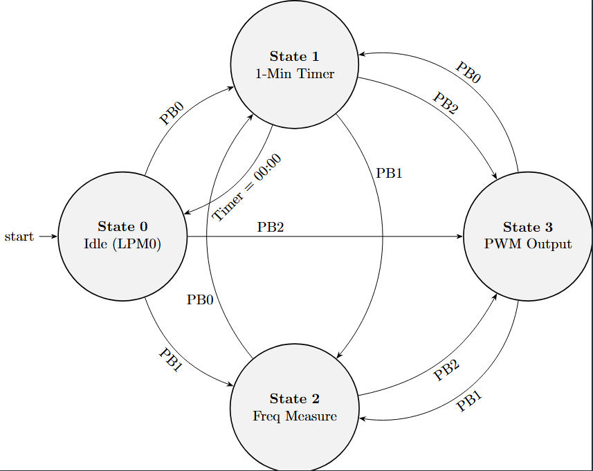

# MSP430G2553 Interrupt-Driven FSM Controller

## Overview
This repository contains an Assembly-level finite state machine (FSM) implementation for the Texas Instruments MSP430G2553 microcontroller. The system is designed with a strict layered software architecture (BSP, HAL, API) to ensure portability and separation of concerns. It leverages hardware timers for concurrent tasks, input capture, and PWM generation, heavily utilizing Low-Power Mode 0 (LPM0) for energy efficiency.

## State Machine Architecture
The system operates based on a 4-state FSM triggered by external hardware interrupts (Pushbuttons).

### States
* **State 0 (Idle):** The system rests in LPM0. CPU is off, waiting for external interrupts.
* **State 1 (Countdown Timer):** Displays a 01:00 to 00:00 countdown on the LCD. Driven entirely by `Timer_A0` interrupts to prevent blocking delays.
* **State 2 (Frequency Measurement):** Utilizes `Timer_A1` Input Capture on pin P2.4 to measure the frequency of an external 0-3V square wave ($100\text{Hz} \le f \le 20\text{kHz}$), displaying the dynamic value on the LCD.
* **State 3 (PWM Output):** Configures `Timer_A1` to output a continuous hardware PWM signal without CPU intervention.

## Hardware Configuration
* **MCU:** MSP430G2553
* **Display:** 16x2 LCD (Data: Port 1, Control: P2.5-P2.7)
* **Inputs:**
    * **PB0 (P2.0):** Triggers State 1 (Timer)
    * **PB1 (P2.1):** Triggers State 2 (Frequency Measure)
    * **PB2 (P2.3):** Triggers State 3 (PWM)
    * **P2.4 (CCI1A):** External frequency input for State 2

## Software Layers
1.  **BSP (Board Support Package):** Handles direct register configurations for GPIO, Watchdog Timer, and initial hardware states.
2.  **HAL (Hardware Abstraction Layer):** Manages all Interrupt Service Routines (ISRs), debouncing macros, and LCD hardware triggers. Controls state transitions and CPU wake/sleep cycles.
3.  **API:** Provides high-level application interfaces for the LCD (string/character printing, display clearing) and manages software-based delays to prevent hardware timer collisions.
4.  **Main:** Contains the primary FSM polling loop, evaluating the `state` variable and routing execution to the corresponding operational logic.

## Authors
Hamza Alhote

Malek Mahajna
